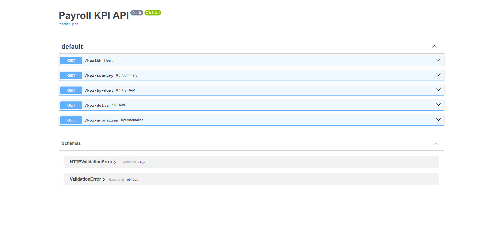
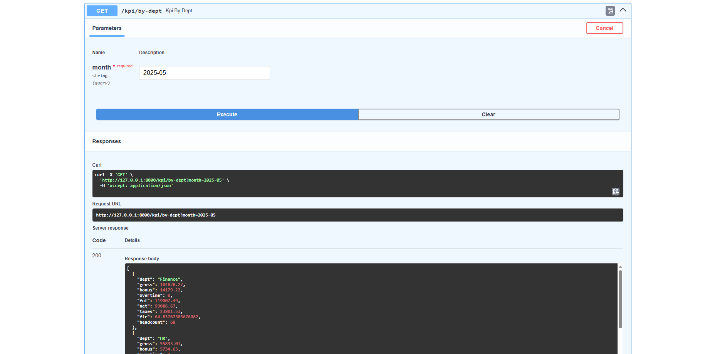
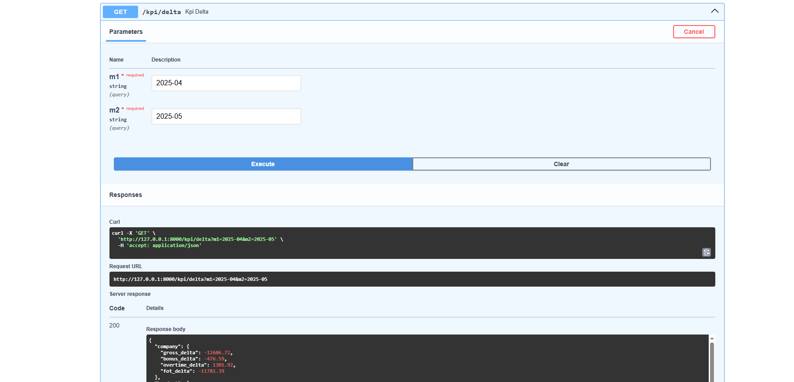
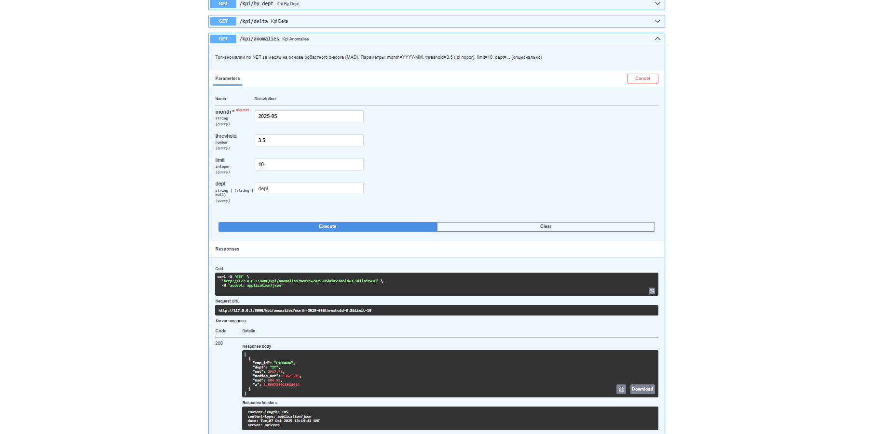

- `GET /kpi/anomalies?month=YYYY-MM[&threshold=3.5][&limit=10][&dept=...]` — топ-аномалии по `net` (робастный z-score по MAD).

# аномалии (общие)
iwr "http://127.0.0.1:8000/kpi/anomalies?month=2025-05&threshold=3.5&limit=10" | % Content | ConvertFrom-Json | ConvertTo-Json -Depth 5
# аномалии по отделу
iwr "http://127.0.0.1:8000/kpi/anomalies?month=2025-05&dept=Production" | % Content | ConvertFrom-Json | ConvertTo-Json -Depth 5


## Скриншоты (Swagger и ответы)

1. Запусти сервер: `uvicorn src.api:app --reload --env-file .env`
2. Открой браузер: `http://127.0.0.1:8000/docs`
3. Разверни методы `/kpi/summary`, `/kpi/by-dept`, `/kpi/delta`, `/kpi/anomalies`,
   введи параметры и нажми **Try it out → Execute**.
4. Сделай снимок экрана (**Win+Shift+S**) и сохрани в `docs/screenshots/`:
   - `docs/screenshots/swagger_overview.png`
   - `docs/screenshots/by_dept_2025-05.png`
   - `docs/screenshots/delta_2025-04_to_2025-05.png`
   - `docs/screenshots/anomalies_2025-05.png`

Вставь в README:
```md






**(Если папки ещё нет) Создай:**
```powershell
mkdir docs\screenshots -Force
